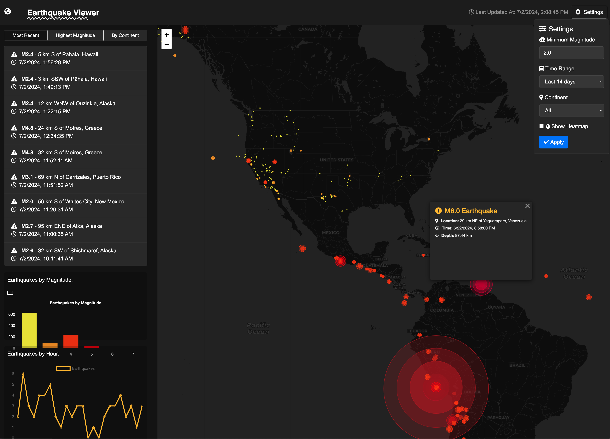

# Earthquake Monitor - Earthquake Tracking Application

## Description

Recent Quakes is a web-based application that provides real-time visualization and information about recent earthquakes worldwide. Using data from the USGS Earthquake Hazards Program, this application offers an interactive map, detailed charts, and a customizable interface to explore seismic activity.

## Features

- Interactive global map showing recent earthquakes
- Color-coded earthquake markers based on magnitude
- Detailed information popup for each earthquake
- Filterable list of recent seismic events
- Statistical charts showing earthquake distribution
- Customizable settings for data visualization
- Heatmap view option for seismic activity density
- Regular data updates to ensure current information

## Technologies Used

- HTML5, CSS3, and JavaScript (ES6+)
- Bootstrap 4 for responsive design
- Leaflet.js for interactive mapping
- Chart.js for data visualization
- USGS Earthquake API for real-time data

## Setup and Installation

1. Clone the repository:
`git clone https://github.com/joeyy-miller/Earthquake-Monitor.git`
2. Navigate to the project directory:
`cd Earthquake-Monitor`
3. Open `index.html` in a web browser.

3. Open `index.html` in a web browser.

Note: This application requires an active internet connection to fetch earthquake data from the USGS API.

## Usage

- The main map displays earthquakes as circular markers. The size and color of the markers indicate the magnitude of the earthquake.
- Click on a marker to view detailed information about the specific earthquake.
- Use the settings panel to adjust the minimum magnitude threshold, time range, and continental filter.
- Toggle between the standard view and heatmap view for different visualizations of seismic activity.
- The sidebar displays a list of recent earthquakes and statistical charts.

## Customization

You can customize various aspects of the application:

- Adjust the color scheme in the `getColorForMagnitude` function.
- Modify the time ranges in the settings panel.
- Add or remove chart types in the `updateCharts` function.

## Contributing

Contributions to improve Recent Quakes are welcome. Please follow these steps:

1. Fork the repository
2. Create a new branch (`git checkout -b feature/AmazingFeature`)
3. Commit your changes (`git commit -m 'Add some AmazingFeature'`)
4. Push to the branch (`git push origin feature/AmazingFeature`)
5. Open a Pull Request

## License

This project is licensed under the MIT License - see the [LICENSE.md](LICENSE.md) file for details.

## Acknowledgments

- Data provided by the [USGS Earthquake Hazards Program](https://earthquake.usgs.gov/fdsnws/event/1/)
- Map tiles by [OpenStreetMap](https://www.openstreetmap.org/)
- Icons by [Font Awesome](https://fontawesome.com/)

## Contact

Joey Miller - github.com/joeyy-miller

Project Link: [https://github.com/joeyy-miller/Earthquake-Monitor](https://github.com/joeyy-miller/Earthquake-Monitor)
